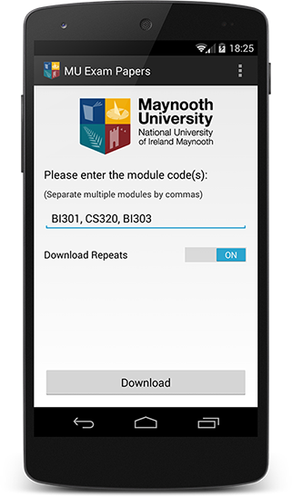
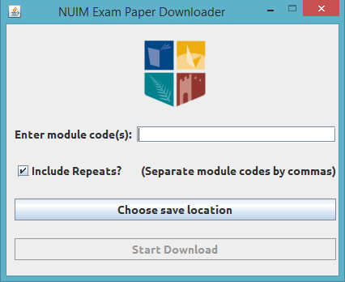
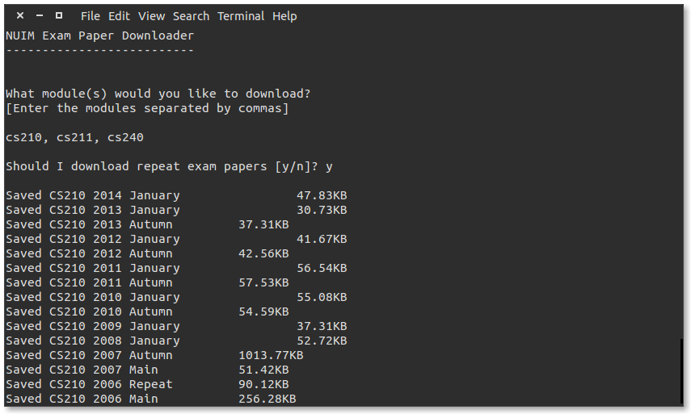

# MU Exam Paper Downloader

#### <mark>No longer works due to authorization requirement</mark>

### Android Version
The Android version is a simple app that batch downloads exam papers from the MU Library website. It is multithreaded so it downloads the .pdfs pretty quickly because of the mutilple threads/connections. It includes an option to download repeats. You can specify multiple modules by separating them by commas. The backend (downloader) is exactly the same as the Java version (see below). *[Lots of repeated code]*

[Download Android Version](Downloads/MU Exam Paper Downloader.apk)

### Java Version
A simple Java Swing program to batch download exam papers from the MU library web site.
Downloads exam papers using multiple threads. Possible to choose multiple modules. Can choose whether to include repeats or not. *[Lots of repeated code]*

[Download Java Version](Downloads/NUIM Exam Paper Downloader.jar)

### Python Version
The Python version is a simple program that runs from the command line. It too can handle multiple modules and provides a choice whether to download repeats or not. It is not multithreaded like the Java verion, so it downloads files one-by-one in a sequential order

[Download Python Version](Downloads/NUIM Exam Paper Downloader.zip)
